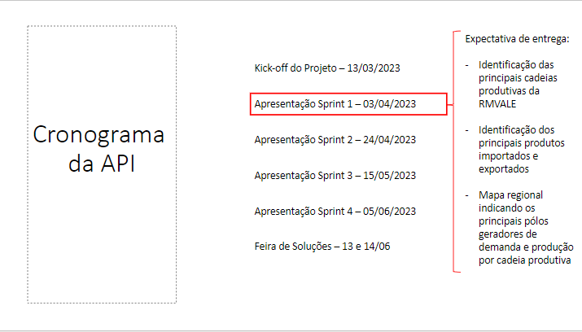

> ## Objetivo do Projeto
>**Mapear e avaliar as cadeias produtivas da RMVALE por meio da coleta, tratamento e análise de dados de importação e exportação.**

## Expectativa de Entrega

  

  
  
  

  
  
  

  
